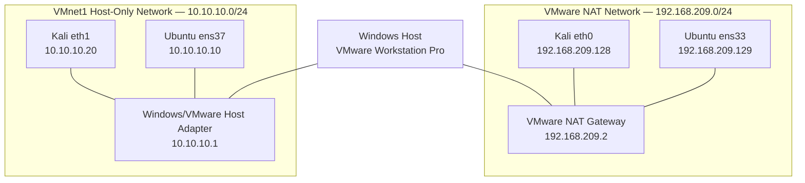
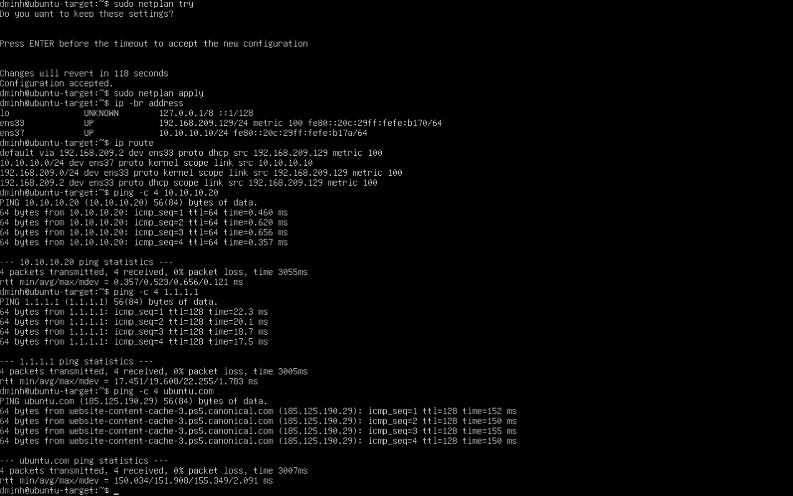
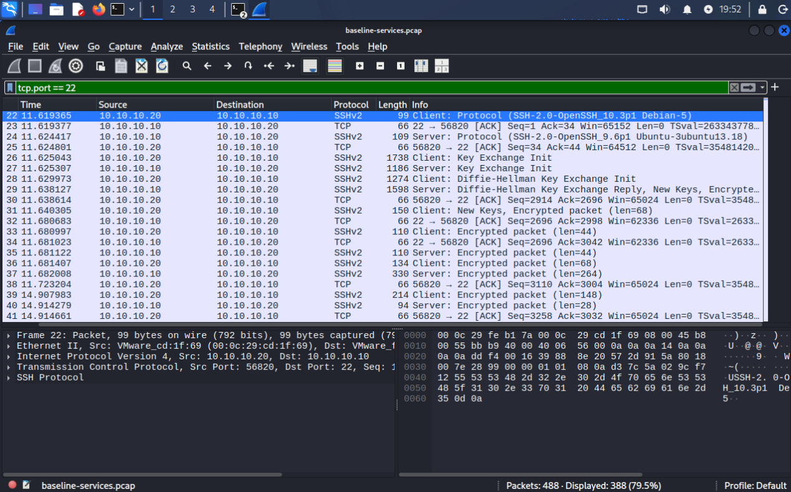
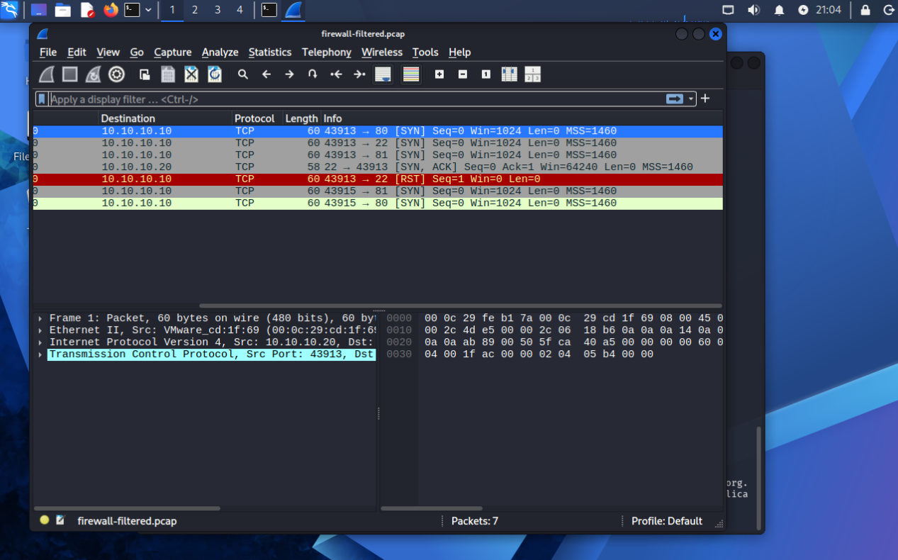
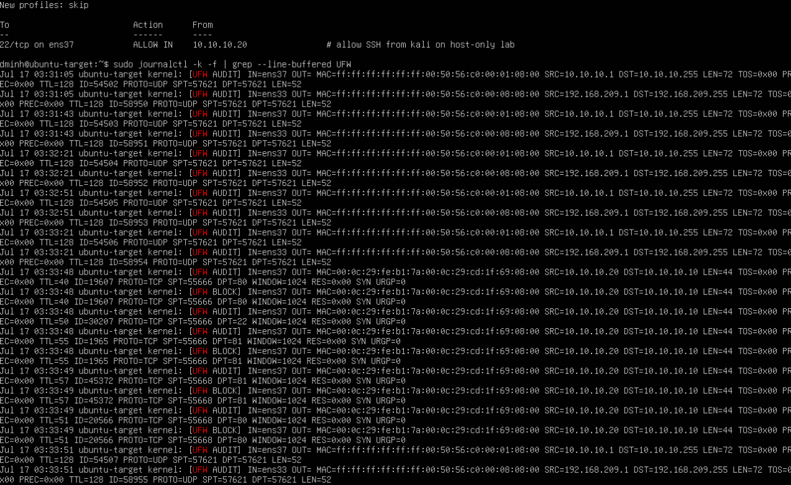

# 01 — Network Baseline and Linux Firewall Hardening

## Summary

For the first project in my cybersecurity home lab, I built a small two-VM environment with an Ubuntu Server target and a Kali Linux analyst workstation. The two systems were connected through an isolated VMware host-only network, while a separate NAT network handled updates and other outbound traffic.

I intentionally kept the environment simple. Rather than begin with a SIEM, Active Directory, or a large collection of security tools, I wanted to understand what the network and the operating systems were doing at a lower level. The project focused on how services become reachable, how Nmap interprets TCP responses, what common protocols look like in a packet capture, and how a host firewall changes what another machine can see.

The project produced three useful TCP port states:

- **Open:** nginx was running and reachable, so Ubuntu responded with a SYN-ACK
- **Closed:** nginx was stopped while the firewall was inactive, so Ubuntu responded with a reset
- **Filtered:** UFW dropped the connection attempt, so Kali received no definitive response

The final configuration leaves nginx disabled, keeps SSH available only from the Kali VM over the host-only interface, denies other unsolicited inbound traffic, and logs blocked packets through UFW.

## Objectives

I wanted this project to accomplish the following:

- Build an isolated two-VM security lab
- Separate internet access from controlled lab communication
- Establish a service and network baseline
- Analyze ARP, ICMP, HTTP, SSH, and Nmap traffic
- Compare open, closed, and filtered TCP behavior
- Apply and validate a least-privilege firewall policy
- Correlate remote scans with packet captures, firewall logs, and local system state
- Preserve enough evidence for another person to verify the results

## Scope and Safety

All activity was performed against virtual machines that I created and controlled.

The target was not bridged directly onto the physical home network. Each VM used two virtual network adapters:

- **NAT:** outbound internet access for updates and package installation
- **Host-only:** isolated communication on `10.10.10.0/24`

The project did not involve malware, credential attacks, intentionally vulnerable public services, or any external system that I did not own.

## Architecture



The host-only interfaces used static addresses and no default gateway. The NAT interfaces received their addresses, gateway, and DNS configuration through DHCP.

As a result:

- Traffic for `10.10.10.0/24` used the host-only interface
- Other destinations used the NAT interface and its default route

## Environment

| Component | Role | Configuration |
|---|---|---|
| Windows host | Physical host and hypervisor platform | VMware Workstation Pro |
| Kali Linux | Analyst workstation | `10.10.10.20/24` on host-only network |
| Ubuntu Server | Managed target | Ubuntu 24.04.4 LTS, `10.10.10.10/24` |
| VMnet1 | Isolated lab network | `10.10.10.0/24`, static guest addresses |
| VMware NAT | Outbound access | `192.168.209.0/24` |
| OpenSSH | Remote administration service | TCP 22 |
| nginx | Temporary web service | TCP 80 |
| Nmap | Remote enumeration | SYN scanning and version detection |
| tcpdump / Wireshark | Packet capture and analysis | PCAP evidence |
| UFW | Host firewall | Default-deny inbound policy and logging |

The baseline scan identified:

- OpenSSH `9.6p1` on TCP 22
- nginx `1.24.0` on TCP 80

## Methodology

### 1. Build and Validate the Virtual Network

Both VMs were connected to the VMware NAT and host-only networks. The host-only network used predictable static addresses:

```text
Kali Linux:    10.10.10.20/24
Ubuntu Server: 10.10.10.10/24
```

I tested connectivity at three levels:

```bash
ping -c 4 10.10.10.10  # Host-only lab connectivity
ping -c 4 1.1.1.1      # External IP routing
ping -c 4 ubuntu.com   # External routing and DNS resolution
```

The routing table confirmed that lab traffic used the host-only interface while internet-bound traffic used the NAT default route.



### 2. Establish the Service Baseline

Ubuntu's listening sockets were inventoried with:

```bash
sudo ss -tulpn
```

OpenSSH was already listening on TCP 22. I then installed and started nginx to create a controlled web-service exposure on TCP 80.

The pre-hardening socket inventory showed both services listening on IPv4 and IPv6:

```text
0.0.0.0:22
0.0.0.0:80
[::]:22
[::]:80
```

From Kali, I verified nginx with `curl` and opened a normal SSH session to Ubuntu.

### 3. Perform the Initial Nmap Scan

The target was scanned from Kali with:

```bash
sudo nmap -sS -sV 10.10.10.10
```

The baseline result was:

```text
22/tcp open  ssh   OpenSSH 9.6p1
80/tcp open  http  nginx 1.24.0
```

The SYN scan classified ports according to their responses: SYN-ACK for open, RST for closed, and no definitive response when filtered. Version detection then identified the services behind the open ports.

The complete output is available in [`baseline-nmap.txt`](./artifacts/scans/baseline-nmap.txt).

### 4. Capture and Analyze Baseline Traffic

Traffic was captured on Ubuntu's host-only interface:

```bash
sudo tcpdump -ni ens37 \
  -w ~/baseline-services.pcap \
  'arp or icmp or tcp port 22 or tcp port 80'
```

Kali then generated:

- ICMP echo requests
- An HTTP request to nginx
- An SSH session
- An Nmap SYN and version-detection scan

The resulting PCAP was analyzed in Wireshark.

#### Local Network Traffic

Before sending traffic directly, Kali used ARP to resolve Ubuntu's `10.10.10.10` address to its virtual MAC address. ICMP echo requests and replies then confirmed direct communication over the host-only subnet.

#### HTTP

The HTTP request was readable in plaintext:

```http
GET / HTTP/1.1
Host: 10.10.10.10
User-Agent: curl
```

Anyone able to observe that network path could read the request and response contents because the connection was not encrypted.

#### SSH

The SSH session began with a normal TCP handshake, readable client and server identification strings, algorithm negotiation, and a key exchange. After the session keys were activated, the interactive traffic appeared only as encrypted SSH packets.



The capture still revealed metadata such as addresses, ports, packet sizes, timing, direction, and connection duration. It did not expose shell commands such as `hostname` as readable plaintext.

The complete capture is available in [`baseline-services.pcap`](./artifacts/pcaps/baseline-services.pcap).

### 5. Compare Open and Closed Service States

I stopped nginx and repeated the scan before enabling UFW.

Ubuntu was still reachable, but no process was listening on TCP 80. The operating system responded to the SYN with a reset, so Nmap reported the port as closed.

This clarified that host reachability and service availability are separate conditions. A machine can be online even when a particular service is not running.

### 6. Apply a Least-Privilege Firewall Policy

UFW was configured with:

```bash
sudo ufw default deny incoming
sudo ufw default allow outgoing

sudo ufw allow in on ens37 \
  from 10.10.10.20 \
  to any port 22 \
  proto tcp \
  comment 'allow SSH from kali on host-only lab'

sudo ufw logging medium
sudo ufw enable
```

The SSH rule required all of the following:

- Incoming interface: `ens37`
- Source: `10.10.10.20`
- Protocol: TCP
- Destination port: 22

No allow rule was created for TCP 80. Port 81 was included in the later scan as an additional filtered comparison.

### 7. Validate the Filtered State

With UFW enabled, Kali scanned ports 22, 80, and 81:

```bash
sudo nmap -sS -sV -p 22,80,81 10.10.10.10
```

The hardened scan reported:

```text
22/tcp open     ssh
80/tcp filtered http
81/tcp filtered hosts2-ns
```

The corresponding packet capture showed:

- Port 22: SYN, SYN-ACK, then RST from the Nmap SYN scan
- Ports 80 and 81: SYN attempts without a SYN-ACK or RST



From Kali's perspective, SSH was clearly open. Ports 80 and 81 were different: the lack of a reply prevented Nmap from determining whether a service existed behind the firewall.

The filtered-state capture is available in [`firewall-filtered.pcap`](./artifacts/pcaps/firewall-filtered.pcap).

### 8. Correlate the Scan with Firewall Logs

UFW logging recorded the same activity seen in the packet capture.

The relevant fields included:

- `IN=ens37`: host-only interface
- `SRC=10.10.10.20`: Kali
- `DST=10.10.10.10`: Ubuntu
- `PROTO=TCP`
- `DPT=80` or `DPT=81`
- `SYN`
- `[UFW BLOCK]`

Port 22 generated an audit entry but was not blocked because it matched the explicit allow rule.



The four evidence sources answered different questions:

| Evidence Source | What It Showed |
|---|---|
| Nmap | How the ports appeared remotely |
| Wireshark | What packets were sent and returned |
| UFW logs | Which packets the firewall blocked |
| `ss` / service state | Whether a process was actually listening locally |

## Results

### Before-and-After Comparison

| Test State | nginx State | UFW Treatment | Remote Nmap Result | Packet Behavior |
|---|---|---|---|---|
| Initial baseline | Running | Firewall inactive | `80/tcp open` | SYN, SYN-ACK |
| Service stopped | Stopped | Firewall inactive | `80/tcp closed` | SYN, RST |
| Firewall filtering | Running | Port 80 blocked | `80/tcp filtered` | SYN, no response |
| Final hardened state | Stopped and disabled | Port 80 blocked by default policy | `80/tcp filtered` | SYN, no response |

The main takeaway was:

> **Local service state and remote network reachability are separate controls.**

A process may be listening locally while a firewall prevents remote access. Stopping an unnecessary service also removes the exposure even if a future firewall rule is configured incorrectly.

### Final Hardened State

The final validation established:

```text
nginx active:  inactive
nginx enabled: disabled

ssh active:    active
ssh enabled:   enabled
```

Only SSH remained as a remotely oriented TCP listener. UFW used:

```text
Default: deny incoming
Default: allow outgoing
Logging: medium
```

The only inbound exception was:

```text
22/tcp on ens37 ALLOW IN 10.10.10.20
```

The complete final validation is available in [`final-validation.txt`](./artifacts/system/final-validation.txt).

## Unexpected Routing Observation

While testing interface failure behavior, I disconnected Kali's host-only interface. I expected communication with Ubuntu's host-only address to stop.

Instead, an ordinary ping to `10.10.10.10` still received replies. Kali's routing output showed that, after the direct `10.10.10.0/24` route disappeared, the destination fell back to the NAT default gateway:

```text
10.10.10.10 via 192.168.209.2 dev eth0
```

A packet capture on Ubuntu's host-only interface showed the requests arriving from `10.10.10.1`, the host side of VMnet1, rather than directly from Kali's NAT address.

The evidence suggested that the VMware or host networking path was forwarding or proxying the traffic between the virtual networks while translating the source address. This was one of the most useful parts of the project because the result contradicted my initial assumption and forced me to check the route and capture the traffic rather than rely on what I expected to happen.

The main lessons from that test were:

- A multihomed system may have more than one usable path
- Disabling one interface does not guarantee that every alternate path disappears
- A successful ping proves reachability, but not the route taken
- `ip route get` can show the sender's selected path
- Captures at different points can reveal translation or unexpected forwarding
- Network segmentation should be tested rather than assumed

## Evidence

### Scans

- [`baseline-nmap.txt`](./artifacts/scans/baseline-nmap.txt)
- [`hardened-nmap.txt`](./artifacts/scans/hardened-nmap.txt)

### Packet Captures

- [`baseline-services.pcap`](./artifacts/pcaps/baseline-services.pcap)
- [`firewall-filtered.pcap`](./artifacts/pcaps/firewall-filtered.pcap)

### Firewall Logs

- [`ufw-scan-events.log`](./artifacts/logs/ufw-scan-events.log)

### System State

- [`listening-sockets-before.txt`](./artifacts/system/listening-sockets-before.txt)
- [`listening-sockets-after.txt`](./artifacts/system/listening-sockets-after.txt)
- [`ufw-status.txt`](./artifacts/system/ufw-status.txt)
- [`ufw-rules-numbered.txt`](./artifacts/system/ufw-rules-numbered.txt)
- [`final-validation.txt`](./artifacts/system/final-validation.txt)

### Artifact Integrity

SHA-256 hashes for the evidence files are stored in [`SHA256SUMS`](./SHA256SUMS).

From the repository root, they can be verified with:

```bash
sha256sum -c projects/01-network-baseline/SHA256SUMS
```

## Skills Practiced

- VMware virtual networking
- IPv4 addressing and routing
- Linux service and socket inspection
- Nmap enumeration and version detection
- tcpdump and Wireshark analysis
- HTTP and SSH traffic comparison
- UFW policy design and logging
- Least-privilege access control
- Evidence correlation and technical documentation

## Lessons Learned

1. **A listening service is not automatically reachable.** Local process state, binding, routing, and firewall policy all affect exposure.

2. **Remote scans provide only an external perspective.** A filtered result does not reveal whether a service is running behind the firewall.

3. **Packet behavior explains scanner classifications.** Open, closed, and filtered states became much easier to understand once I could compare SYN-ACK, RST, and silence in Wireshark.

4. **Encryption protects content, but not all metadata.** SSH concealed commands and responses after key establishment, but addresses, ports, timing, and traffic volume remained visible.

5. **Conclusions are stronger when multiple sources agree.** Nmap, Wireshark, UFW logs, and local socket inspection each described a different part of the same activity.

6. **Service reduction and firewall filtering work better together.** Disabling nginx removed the unnecessary listener, while UFW continued to deny unapproved inbound traffic.

7. **Network paths should be verified.** The unexpected routing result showed how alternate paths and address translation can complicate segmentation.

8. **Evidence organization is part of the project.** Producing the scans and captures was only part of the work. Naming, preserving, hashing, and documenting the artifacts took more effort than I expected.

## Limitations

- The lab contained only two guest systems and did not model a larger routed enterprise network
- UFW represented a host firewall rather than a dedicated network firewall
- The project focused primarily on IPv4
- No IDS, SIEM, or centralized logging platform was used
- SSH cryptography was observed at the protocol level, but its underlying mathematics and implementation security were outside the project's scope
- The environment used controlled benign traffic rather than realistic attack simulation

## Future Extensions

Direct extensions of this project include:

- Replacing password-based SSH access with key authentication
- Serving the web application over TLS and comparing HTTP with HTTPS captures
- Adding Linux audit or endpoint telemetry
- Introducing another subnet and testing routing and segmentation
- Automating firewall and service-state validation

## Detailed Notes

A deeper explanation of the networking concepts, commands, observations, and troubleshooting process is available in [`technical-notes.md`](./technical-notes.md).